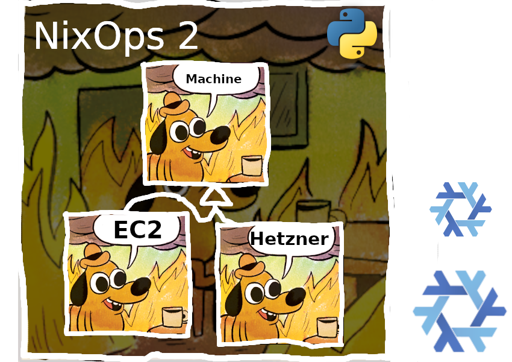

# NixOps4


<!--
_class: invert lead
-->

- Why
- What
- How
- Demo


# Why

- NixOps 1 is a tool to deploy NixOS systems
- Provisioning
- Secrets
- Other resources, such as AWS Route53, etc
- Python program
- Call Nix evaluator twice

<!--
  calling the evaluator twice is not good enough
-->


# Architecture

NixOps 2

2013 - 2020 - ...



<!--

I sincerely apologize to the authors and previous maintainers.
They did a good job with the architecture they had.

- Plugin system
- Ossified the architecture
-->


# Architecture

Nix

```


┌────────────┐                      ┌────────────────────┐
│ Nix        │---- instantiate ---->│ Derivations        │ ↺ store path
│ expression │                      └────────────────────┘
│ language   │                                ⇑ builds
│            │                      ┌────────────────────┐
│            │                      │ Nix sandbox, store │
└────────────┘                      └────────────────────┘
```

<!--
  Explain thoroughly
-->

# Architecture

NixOps4

```
┌────────────┐                      ┌────────────────────┐
│ Nix        │---- configure ------>│ Resources          │ ↺ nix value
│ expression │                      └────────────────────┘
│ language   │                                ⇑ run output
│            │                      ┌────────────────────┐
│            │---- instantiate ---->│ Derivations        │ ↺ store path
│            │                      └────────────────────┘
│            │                                ⇑ builds
│            │                      ┌────────────────────┐
│            │                      │ Nix sandbox, store │
└────────────┘                      └────────────────────┘
```

<!--
Adds new layer on top

Focus on `nix value` => precisely that; no tight coupling between NixOps and its resources

NixOps4 just manages the data flows generically

Another benefit
 - resource can be implemented in any language, with any library

Not comparable to NixOps 2 architecture image. NixOps 2 is "just a script" that grew until it failed to scale and then ossified with plugins.

-->


# Resource

- Declares the existence of a real world object
- Operations
  - Create
  - Read
  - Update
  - Delete

# Resource Provider

- Separate process
- executable obtained with Nix.

# Operations

- CRUD

- "`nix run`"
  - backup
  - key rotation

<!--
  a. Arbitrary callable methods in resource provider
  b. Scripts depending on resource outputs 
-->

# Process Architecture

- NixOps4
  - `nixops4-eval` -> `libnixexpr` etc (internal)
  - resource providers
    - `nixops4-resources-local`
    - `nixops4-resources-opentofu` (planned)
    - ...

# Expressions

Simplified

```nix
{ # flake.nix
  outputs = inputs: {
    nixops4Deployments.default = { resources, ... }: {
      resources = {
        "state" = {
          ...
        };
      };
    };
  };
}
```

# Expressions

```nix
{ resources, ... }: {
  resources = {
    "state" = {
      type = "s3.object";
      inputs = {
        endpoint = "https://garage.example.com";
        bucket = "nixops4-my-project";
      };
    };
  };
}
```

# Expressions

```nix
{ resources, ... }: {
  resources = {
    "state" = ...;
    


  
  };
}
```

# Expressions

```nix
{ resources, ... }: {
  resources = {
    "state" = ...;
    "sshkey" = {
      type = "ssh.key";
      inputs = {
        state = resources.state.handle;
      };
    };
  };
}
```

# Expressions

```nix
{ resources, ... }: {
  resources = {
    "state" = ...;
    "sshkey" = ...;
    "nixos" = {
      imports = [ inputs.nixos.modules.nixops4Resource.nixos ];
      inputs = {
        ssh.privateKey = resources.sshkey.privateKey;
        ssh.host = resources.host;
        module = ./configuration.nix;
      };
    };
  };
}
```

# Expressions

```nix
{ resources, ... }: {
  options.customers = mkOption {
    type = attrsOf (submodule ./customer.nix);
  };
  config.resources = {
    "state" = ...;
    "sshkey" = ...;
    "nixos" = ...;
  };
}
```

# Expressions

```nix
{ resources, ... }: {
  imports = [
    ./data-model.nix
    ./applications/pixelfed.nix
    ./applications/mastodon.nix
    ./applications/peertube.nix
  ];
}
```

# Expressions

- `resources` monoid in the category of endofunctors :wink:
- Structural composition like `attrsOf` or `submodule`
  - `imports` is mix-ins

```nix
top@{ resources, ... }: {
  resources = {
    "state" = ...;
    "my-host" = mkSequence ({ resources, ... }: {
      "sshkey" = ... top.resources.state.handle ...;
      "nixos" = ... resources.sshkey.privateKey ...;
    });
  };
}
```

# Module author benefits

- All-Nix development experience
- No glue code
- All declarative

# Application benefits

"NixPanel"

- Structured logging

- Separate evaluator for stability

# Operator benefits

CLI interface for the backend

Integrate arbitrary scripts, no glue code

# Demo?

# Not discussed

- Resource naming within the state
  - read multiple => migrations

- `resourceProviderSystem`
